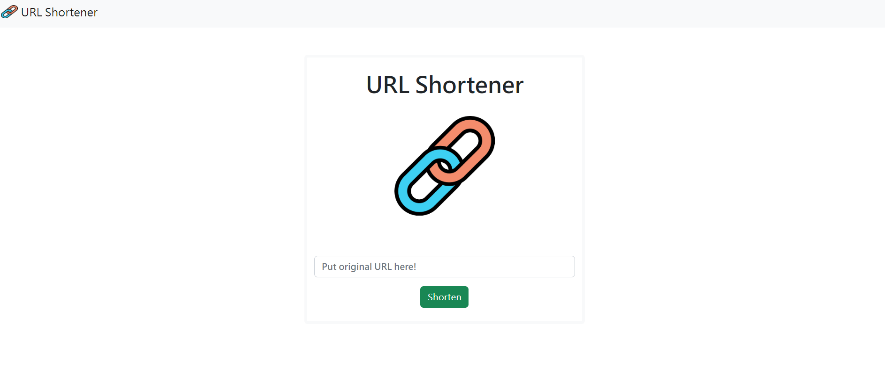

# URL Shortener



## 軟體及模組版本

```
"body-parser": "^1.20.0"
"dotenv": "^16.0.1"
"express": "^4.18.1"
"express-handlebars": "^4.0.2"
"mongoose": "^6.3.4"
```

## 安裝及執行

- 下載到本地

```
git clone https://github.com/wuwachon/URL_Shortener
```

- 安裝相關套件

```
cd URL_Shortener
npm install
```

- 本地 MongoDB 資料庫
  修改`.env.example`檔案內 MONGODB_URI 使用者名稱及密碼等參數並移除`.example`副檔名
- 執行專案

```
npm run dev
```

Terminal 顯示 http://localhost:3000 即表示啟動完成，可至此網址網頁觀看畫面測試功能

## 專案功能描述

- 使用者可以在表單輸入原始網址並得到格式化後的短網址
- 使用者可以在瀏覽器的網址列輸入短網址，瀏覽器就會導向原本的網站

## 練習技巧

- express、mongoose 及其他 npm 套件應用練習
